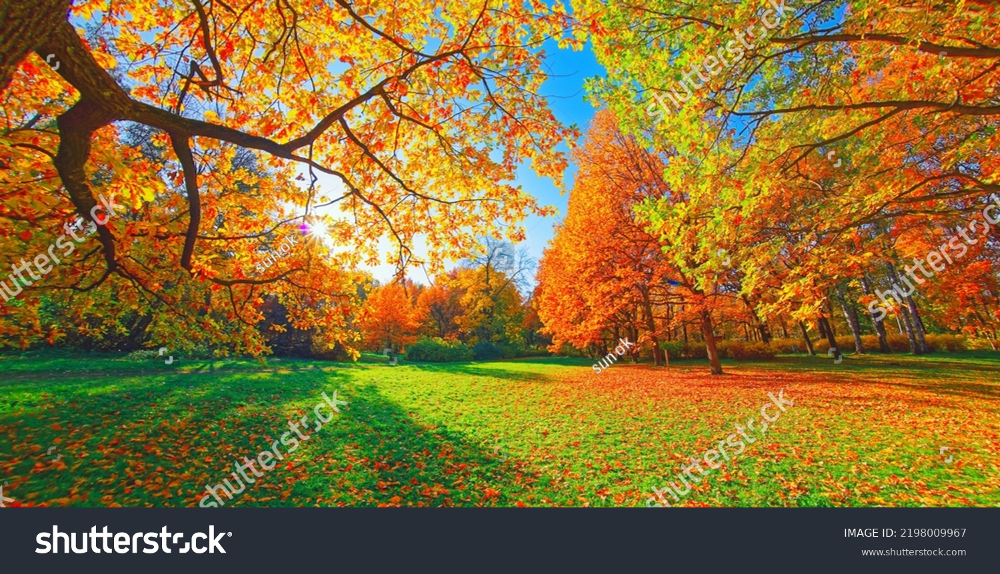
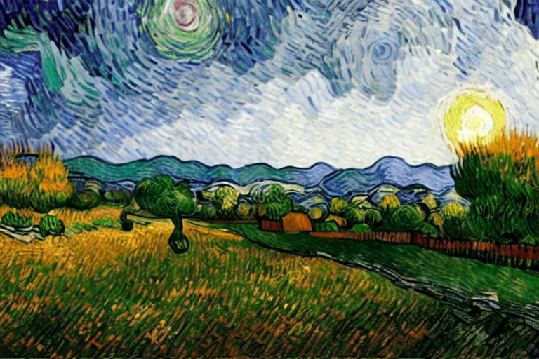

# Image Style Transfer with Stable Diffusion (cog-stable-diffusion-img2img)

[](https://huggingface.co)


[](https://replicate.com/replicate/stable-diffusion-img2img) 
[](https://www.nvidia.com/)
[](https://opensource.org/licenses/MIT)

## Van Gogh-fy your images 😄

This project provides a Cog model for image style transfer using the Stable Diffusion method. The implementation is based on the [Diffusers Stable Diffusion v1-5](https://huggingface.co/runwayml/stable-diffusion-v1-5) and is packaged as a Cog model, making it easy to use and deploy.

This is an [Cog packages machine learning models as standard containers.](https://github.com/replicate/cog)

The Stable Diffusion method allows you to transform an input photo into various artistic styles using a text prompt as guidance. The model utilizes the power of Hugging Face Transformers and NVIDIA CUDA Toolkit to achieve efficient GPU-accelerated image processing.

## Try it out on Replicate 🚀

<div style="display: flex; justify-content: center; align-items: center; padding: 10px;">
    <a href="https://replicate.com/abhishek7kalra/vangogh/">
        
    </a>
</div>
<p align="center"><strong>Click the image ⬆️</strong></p>

## Example:


<div style="display: flex;">
    <div style="text-align: center; flex: 50%; margin-right: 20px;">
        
        <p>Input Image</p>
    </div>
    <div style="text-align: center; flex: 50%;">
        
        <p>Output Image</p>
    </div>
</div>


In this example, we used the cog-stable-diffusion-img2img model to apply an artistic style to an input photo. The text prompt provided was "Van Gogh style," resulting in the output image shown above.


## Installation:

To use the cog-stable-diffusion-img2img model, follow these steps:

1. First, download the pre-trained weights by running the following command:

```bash
cog run script/download-weights
```

Then, you can run predictions:

    cog predict -i input_photo=@testimg.jpeg

The default promt for this pipeline is "Van Gogh style", which changes the style of an external photo to a Vincent van Gogh portrait.

You can also run this pipeline with your choice of prompt and input image.

```bash
cog predict -i prompt="Your text prompt here" -i image=@path/to/your/input_image.jpg
```
Replace *"Your text prompt here"* with the text prompt you want to use for guiding the image generation, and *"path/to/your/input_image.jpg"* with the path to the input photo you wish to transform.

The model will produce one or more output images based on the provided text prompt and input image.

## Contributing

Contributions are welcome! If you find any bugs, create an issue or submit a pull request with your proposed changes.

## License

This project is licensed under the MIT License.

## Contact

This is an open-source project developed by [Abhishek Kalra](https://github.com/abhishek7kalra). 

[](mailto:abhishek7.kalra@gmail.com)
